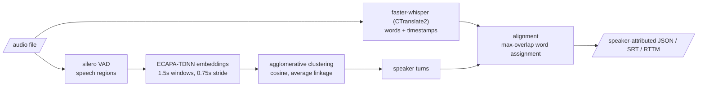

# speech-diarization-lab

[](https://github.com/gradientsj/speech-diarization-lab/actions/workflows/ci.yml)

Speaker-attributed transcription: who said what, with timestamps, from a
single audio file. Whisper (via CTranslate2) produces the words, a
diarization pipeline built from open parts produces the speakers, and a
tested alignment joins them. Everything that decides the output is scored:
WER and DER are implemented from scratch against hand-computed values, and
the diarizer is evaluated against the pretrained pyannote reference under
identical metrics on a reproducible benchmark.

**[Listen to the output](https://gradientsj.github.io/speech-diarization-lab/)**:
three benchmark mixtures with the speaker-attributed transcript synced to the
audio: per-speaker timeline, click-any-word-to-seek, live word highlighting.
The transcripts shown are real pipeline output, hallucinations and all (the
trailing *"Thank you for watching."* on mix_000 is Whisper inventing words
over silence, visible in one listen and invisible in a pooled WER).

## The problem

A transcript without speakers is close to unusable for meetings, interviews,
and calls; "who said what" is the actual product. Off-the-shelf pieces exist
for each stage (ASR, voice activity detection, speaker embeddings,
diarization pipelines), but the joins between them are where quality is won
or lost, and the joins are exactly what turnkey wrappers hide. This repo
builds the full path with every join visible and tested.

## The pipeline



Two diarization backends sit behind one interface, the same shape as my
other lab repos: a thing built from parts compared against a pretrained
reference.

- **`clustered`** (built here): silero VAD, windowed ECAPA-TDNN speaker
  embeddings, agglomerative clustering over cosine distance, turn building.
  Every stage boundary is a pure function with unit tests; the model calls
  are thin, isolated wrappers.
- **`pyannote`** (reference): the pretrained
  `pyannote/speaker-diarization-3.1` pipeline. Gated on Hugging Face, so it
  needs `HF_TOKEN` with the model terms accepted.

## Quickstart

```bash
uv sync --extra models          # core install is light; model backends are an extra

# full pipeline: transcribe + diarize + align
uv run diarlab attribute meeting.wav --srt meeting.srt

# stages individually
uv run diarlab transcribe meeting.wav --model small --compute-type int8
uv run diarlab diarize meeting.wav --num-speakers 2

# the gated reference backend (after accepting the pyannote model terms)
uv sync --extra reference
uv run diarlab diarize meeting.wav --backend pyannote

# the HTTP serving layer: upload a file, poll the job, fetch JSON or SRT
uv sync --extra models --extra serve
uv run uvicorn diarlab.server:app --port 8000
curl -X POST localhost:8000/jobs -F file=@meeting.wav   # -> {"id": ...}
curl localhost:8000/jobs/<id>                           # -> status + segments
curl localhost:8000/jobs/<id>/srt                       # -> subtitles
websocat ws://localhost:8000/jobs/<id>/stream           # -> segments live
```

The WebSocket emits each speaker-attributed segment as the decode produces
it (diarization runs first because it is the fast stage, then ASR segments
are attributed as faster-whisper yields them), followed by a final status
event. Connecting after completion replays the same stream.

The server runs jobs on one worker thread: the models load once and the GPU
is a serial resource. The measured real-time factors say that is enough for
interactive use (small/float16 transcribes at 0.022 RTF on an A10, roughly
45x real time); scaling past one box is a load balancer in front of more
instances, not threads. Model, device, and compute type come from
`DIARLAB_MODEL` / `DIARLAB_DEVICE` / `DIARLAB_COMPUTE`.

## Running the benchmark

The whole loop is three commands; the corpus is public and the mixtures are
seeded, so any machine reproduces the same benchmark bit for bit.

```bash
uv sync --extra models
uv run python -m diarlab.bench fetch      # LibriSpeech dev-clean, 337 MB
uv run python -m diarlab.bench build      # 12 seeded mixtures + manifest
uv run python -m diarlab.bench run --model small --compute-type int8 --device cpu
```

Each `run` writes `reports/benchmark_<backend>_<model>_<compute>_<device>.json`
with pooled WER, DER (split into miss / false alarm / confusion), per-mixture
rows, and ASR real-time factors.

A fourth subcommand calibrates the pipeline's tunable parameters, one at a
time, each chosen on half the mixtures and scored on the half it never saw:

```bash
uv run python -m diarlab.bench sweep --param threshold --device cuda
uv run python -m diarlab.bench sweep --param pad --device cuda
```

The threshold sweep embeds once per mixture and reruns only the clustering,
so it costs about one benchmark run; the pad sweep changes the regions and
re-embeds per grid value. Each writes its full grid to
`reports/<param>_sweep.json`.

There are two more benchmark sets behind `--set`: the overlap variant of
the synthetic mixtures (speaker changes partially overlap with probability
0.5 and the waveforms sum), and AMI headset mix, the real-conversation
check (CC BY 4.0, no credentials):

```bash
uv run python -m diarlab.bench build --overlap-prob 0.5
uv run python -m diarlab.bench run --set overlap --device cuda

uv run python -m diarlab.bench fetch-ami     # 3 meetings + annotations, ~170 MB
uv run python -m diarlab.bench run --set ami --device cuda
```

On a CUDA box (tested on Lambda Stack / Ubuntu 22.04):

```bash
curl -LsSf https://astral.sh/uv/install.sh | sh
git clone https://github.com/gradientsj/speech-diarization-lab && cd speech-diarization-lab
uv sync --extra models
uv run python -m diarlab.bench fetch && uv run python -m diarlab.bench build
uv run python -m diarlab.bench run --model large-v3 --compute-type float16 --device cuda
```

If CTranslate2 cannot find cuDNN/cuBLAS (a `libcudnn` load error), point it
at the pip-installed NVIDIA libraries:

```bash
export LD_LIBRARY_PATH=$(uv run python -c "import os, nvidia.cublas.lib, nvidia.cudnn.lib; print(os.path.dirname(nvidia.cublas.lib.__file__) + ':' + os.path.dirname(nvidia.cudnn.lib.__file__))")
```

The gated reference backend, once `HF_TOKEN` is set and the pyannote model
terms are accepted:

```bash
uv sync --extra models --extra reference
uv run python -m diarlab.bench run --backend pyannote --device cuda
```

## How it is measured

- **WER** (word error rate) for transcription and **DER** (diarization error
  rate, md-eval semantics: missed speech + false alarm + speaker confusion
  over reference speech time, with a no-score collar and Hungarian speaker
  mapping) are implemented from scratch in plain Python and tested against
  hand-computed values, including the overlap and collar cases. The scoring
  math is the product here, so it should be auditable rather than imported.
- Where a metric is undefined (empty reference), it returns NaN, and NaN
  must be treated as a failure by anything gating on it.
- The benchmark is **synthetic conversations built from LibriSpeech**:
  single-speaker utterances interleaved with seeded gaps, so turn boundaries
  and transcripts are exact by construction and nothing requires credentials
  to download. The trade-off is stated plainly: no overlapped speech, no
  channel mismatch, read-speech acoustics. Scores on it are an upper bound
  on conversational performance and are for comparing systems under
  identical conditions, not for quoting as real-world accuracy.

## Results

Pooled over the 12 mixtures (10.9 minutes of audio, 2-4 speakers each),
DER collar 0.25 s; the clustered backend's distance threshold is stated per
row. GPU rows ran on an NVIDIA A10 (Lambda, Ubuntu 22.04), CPU rows on a
consumer Windows desktop. Per-mixture rows and exact configs are in
`reports/`.

### Transcription and serving

| model | compute | hardware | WER | mean RTF |
|---|---|---|---:|---:|
| tiny | float16 | A10 | 5.50% | 0.015 |
| base | float16 | A10 | 3.87% | 0.016 |
| small | float16 | A10 | **2.84%** | 0.022 |
| large-v3 | float16 | A10 | 4.23% | 0.087 |
| large-v3 | int8_float16 | A10 | 4.59% | 0.098 |
| large-v3 | int8 | A10 | 3.87% | 0.083 |
| tiny | int8 | CPU | 5.68% | 0.117 |
| base | int8 | CPU | 3.57% | 0.185 |
| small | int8 | CPU | 6.17% | 0.559 |

What the table says:

- **small beats large-v3 on this benchmark** (2.84% vs 3.87-4.59% at
  float16), at a quarter of the RTF. On clean read speech the largest model
  buys nothing, which is exactly why serving decisions should be made from
  a measured table rather than from model reputation.
- **int8 quantization is mostly accuracy-neutral, with one revealing
  exception.** On tiny, base, and large-v3 it matches float16 (it even
  edges it out on large-v3). On small, 11 of 12 mixtures match float16
  within noise, but on one mixture the int8 model silently drops whole
  utterances (59 of 157 reference words deleted, that mixture's WER 40.1%
  vs 3.8% at float16), inflating the pooled WER from 2.84% to 6.17%.
  Aggregate numbers hide exactly this kind of tail failure; the
  per-mixture rows in `reports/` are what surfaced it.
- RTF below 0.1 everywhere on the A10 means the full large-v3 pipeline
  clears real time with >10x headroom, and CPU int8 keeps even small at
  ~2x real time with tiny at 8.5x.

### Diarization

| backend | speaker count | threshold / pad | DER | miss | false alarm | confusion |
|---|---|---|---:|---:|---:|---:|
| clustered (from parts) | estimated | 0.75 / 0.25 (both calibrated) | **0.38%** | 0.32% | 0.06% | 0.00% |
| clustered (from parts) | estimated | 0.75 / 0.05 | 4.36% | 4.36% | 0.00% | 0.00% |
| clustered (from parts) | estimated | 0.60 / 0.05 (original) | 5.64% | 4.36% | 0.00% | 1.28% |
| clustered (from parts) | oracle | 0.60 / 0.05 | 4.36% | 4.36% | 0.00% | 0.00% |
| pyannote-3.1 (reference) | estimated | n/a | 9.80% | 7.57% | 0.00% | 2.24% |

- The DER is **identical across every ASR configuration and across
  Windows-CPU vs Linux-A10**, per mixture to three decimals: the diarizer
  is fully decoupled from the ASR and deterministic across platforms.
- Given the true speaker count, confusion drops to exactly zero: clustering
  itself attributes no time to the wrong speaker on these mixtures. The
  whole 1.28% confusion component at the old 0.60 threshold came from
  overcounting speakers (3->4, 4->5 on a few mixtures), and the 4.36% floor
  is missed speech at VAD boundaries. Each error component points at
  exactly one stage to improve, and the threshold calibration below
  recovered the confusion component without being given the count.
- **The from-parts pipeline beats the pretrained reference here, and the
  caveat matters as much as the number.** pyannote-3.1 scores 9.80% on the
  same mixtures under the same DER implementation, with the gap mostly in
  missed speech (7.57% vs 4.36%): its segmentation trims utterance
  boundaries more aggressively than silero VAD on clean read speech with
  hard turn changes. That is the regime this benchmark constructs and the
  regime the simple pipeline is built for; pyannote is tuned for
  conversational audio with overlap and boundary ambiguity, none of which
  exists here. It estimated the speaker count correctly on 11 of 12
  mixtures (one 2->3 overcount). The honest claim is narrow: on
  non-overlapped read-speech mixtures, VAD + ECAPA + agglomerative
  clustering is sufficient and the heavier pipeline buys nothing; the
  overlapped-speech section below tests whether that holds once speakers
  talk over each other.

### Calibration

The from-parts pipeline has two tunable constants: the clustering distance
threshold and the VAD edge padding. `bench sweep` calibrates each honestly,
chosen on six mixtures and scored on the six it never saw. Each parameter
is swept with the other at its shipped value, and the chosen pair was
re-verified jointly. Full grids in `reports/threshold_sweep.json` and
`reports/pad_sweep.json`.

The threshold sweep (at pad 0.25):

| threshold | calibration DER | held-out DER | speaker count correct |
|---:|---:|---:|---:|
| 0.50 | 32.57% | 30.53% | 0/12 |
| 0.55 | 14.96% | 13.38% | 1/12 |
| 0.60 | 3.05% | 4.37% | 3/12 |
| 0.70 | 0.96% | 0.83% | 9/12 |
| **0.75** | **0.30%** | **0.46%** | **12/12** |
| 0.80 | 0.30% | 2.43% | 11/12 |
| 0.85 | 0.30% | 8.48% | 10/12 |
| 0.90 | 2.41% | 31.66% | 5/12 |

What the sweep says:

- **At 0.75 the count is right on all 12 mixtures and confusion is exactly
  zero**, so DER collapses to the padded VAD's residual miss. The first
  sweep (run at the old 0.05 pad) chose the same 0.75, which is why it is
  the shipped default.
- **The failure mode is asymmetric.** Below 0.75 the curve degrades
  smoothly; above 0.80 it collapses (8.5% at 0.85, 31.7% at 0.90) as
  distinct speakers merge into one cluster. Undercutting the threshold
  splits one speaker into two, which the Hungarian mapping partially
  forgives; overcutting merges two speakers into one, which it cannot.
  Err low.
- The usual caveat: 0.75 is calibrated on clean read speech. The value to
  trust is the shape of the curve and the calibration procedure, not the
  constant; on a new acoustic regime, rerun the sweep.

The pad sweep (at threshold 0.75) attacks what was left, the miss floor:

| pad | calibration DER | held-out DER | miss | false alarm | confusion |
|---:|---:|---:|---:|---:|---:|
| 0.00 | 6.35% | 5.42% | 5.83% | 0.00% | 0.07% |
| 0.05 | 4.94% | 3.73% | 4.36% | 0.00% | 0.00% |
| 0.15 | 2.27% | 1.79% | 2.04% | 0.00% | 0.00% |
| **0.25** | **0.30%** | **0.46%** | **0.32%** | **0.06%** | **0.00%** |
| 0.30 | 0.44% | 0.60% | 0.07% | 0.12% | 0.33% |
| 0.40 | 1.27% | 0.85% | 0.00% | 0.44% | 0.62% |

(miss / false alarm / confusion pooled over all 12 mixtures)

- **The "miss floor" was VAD edge trimming all along.** Padding regions by
  250 ms takes pooled DER from 4.36% to 0.38%, with the speaker count still
  right on 12 of 12.
- **The calibrated pad equals the scoring collar, and that is not a
  coincidence.** DER does not score within 0.25 s of reference boundaries,
  precisely because boundary placement is ambiguous, so padding up to the
  collar's edge recovers trimmed speech nearly free of false-alarm cost.
  Stated plainly: part of this gain is an artifact of how DER scores
  boundaries, which is why the collar is reported with every number.
- Past 0.30 the padding bridges the silence gaps between speakers, windows
  start crossing turn boundaries, and confusion comes back. Same lesson as
  the threshold: the cliff is on the over-merging side.

### Overlapped speech

The same systems on the overlap variant (speaker changes overlap with
probability 0.5; 6.5% of all speech time is overlapped), with no
recalibration:

| backend | DER | miss | false alarm | confusion |
|---|---:|---:|---:|---:|
| clustered (from parts) | **4.50%** | 4.13% | 0.03% | 0.33% |
| pyannote-3.1 (reference) | 11.73% | 7.63% | 0.00% | 4.10% |

- **The miss component is the overlap, almost exactly.** The clustered
  pipeline emits one speaker at a time by construction, so wherever two
  speakers talk at once it must miss one of them: 4.13% missed against
  6.5% overlapped time (the collar absorbs the rest). The error is
  structural and fully predicted by the architecture.
- **The expected ranking flip did not happen.** pyannote 3.1 can emit
  overlapping turns, and this set was the chance for that to pay off;
  instead its miss is still higher than the clustered pipeline's
  (7.63% vs 4.13%) and its confusion grows to 4.10%. On short, clean,
  partially overlapped read speech the heavier model still does not earn
  its keep. The honest hypothesis stays open: longer overlaps,
  conversational acoustics, or real corpora (AMI below) may yet flip it.
- ASR degrades too: WER for the same small/float16 model rises from 2.84%
  on the plain set to 3.75% here, since Whisper transcribes one stream and
  overlapped words are unrecoverable by design.

### Real conversations: AMI headset mix

Three 4-speaker meetings from the AMI test partition (ES2004a, IS1009b,
TS3003a; 77 minutes of audio across three recording sites), scored with
the same DER implementation. Reference turns come from AMI's transcriber
segments and genuinely overlap; collar 0.25 s; no recalibration of
anything.

| backend | DER | miss | false alarm | confusion |
|---|---:|---:|---:|---:|
| clustered (from parts) | 18.71% | 12.90% | 0.47% | 5.34% |
| pyannote-3.1 (reference) | **13.25%** | 10.57% | 0.51% | 2.18% |

- **The ranking finally flips.** On synthetic mixtures the from-parts
  pipeline beat the reference twice; on real meetings pyannote wins by
  5.5 points. Both results are real, and together they are the point of
  this repo: the simple pipeline is sufficient exactly up to the regime
  it was built and calibrated for, and a benchmark that cannot make the
  pretrained model win was measuring the wrong thing.
- **Calibration transfer fails loudly, as promised.** The 0.75 threshold,
  calibrated on clean read speech, estimates 24 to 50 speakers for these
  4-person meetings; spontaneous speech embeddings spread far wider than
  read speech. The caveat written next to the calibrated default
  ("on a new acoustic regime, rerun the sweep") was load-bearing. DER
  survives as well as it does (the Hungarian mapping scores the best four
  clusters) but the speaker count output is unusable here.
- **Long real audio exposes an ASR tail failure mode.** small/float16
  fell into a repetition loop on TS3003a (92.5% WER on that meeting,
  pooling to 40.7%); the same model at int8 scored 23.6% on the same
  audio. The second tail event of this kind in the project, and both were
  invisible in pooled means until the per-file rows were read.
- Anchoring against published numbers, with the protocol differences
  stated: the pyannote 3.1 model card reports 18.8% DER on the full AMI
  headset-mix test set with no collar and word-based references. This
  measurement is 13.25% with a 0.25 s collar, transcriber-segment
  references, and three meetings, so it is consistent in ballpark and not
  a leaderboard claim. WER on this set is approximate by construction:
  the reference interleaves all speakers in time order, so no single word
  order is canonical where speech overlaps.

## Repository layout

```
src/diarlab/
  metrics.py     # WER + DER from scratch, tested against hand-computed values
  align.py       # word -> speaker assignment rules (max overlap, gap fallback)
  windows.py     # VAD post-processing, embedding windows, turn building (pure)
  cluster.py     # agglomerative clustering over cosine distance
  mixtures.py    # synthetic conversations with exact ground truth
  asr.py         # faster-whisper wrapper (lazy import)
  vad.py         # silero VAD wrapper (lazy import)
  embeddings.py  # ECAPA-TDNN wrapper (lazy import)
  diarize.py     # the two backends behind one interface
  formats.py     # JSON / SRT / RTTM writers
  audio.py       # mono float32 loading + polyphase resampling
  cli.py         # transcribe / diarize / attribute
  server.py      # FastAPI upload -> job -> JSON/SRT (pipeline injectable)
  bench.py       # fetch / build / run / sweep
tests/           # CPU-only, no model downloads (the server is tested with
                 # an injected stub pipeline)
```

## What I'd do next

1. **Recalibrate per domain**: let `bench sweep` run on any `--set`, then
   calibrate the threshold and pad on AMI dev meetings and report how far
   domain-matched calibration closes the 5.5-point gap to pyannote. The
   AMI run showed the constants do not transfer; the procedure should.
2. **Guard the ASR decode on long audio**: the TS3003a repetition loop
   (92.5% WER at float16, 23.6% at int8) wants a fix and a regression
   check, likely conditioning and temperature-fallback settings exposed
   through the wrapper.
3. **Overlap-aware turns**: the 4.13% miss on the overlap set is
   structural, since the clustered pipeline emits one speaker at a time. A
   second-pass overlap detector (or per-window soft assignment to two
   clusters) is the targeted fix.
4. **Reference vs hypothesis in the demo**: a toggle on the demo timeline
   showing the ground-truth turns under the predicted ones, so diarization
   errors are visible instead of only scored.
5. **A Dockerfile for the server**, with the cuDNN/cuBLAS path baked in,
   so the serving layer deploys without the runbook.

## License

MIT
