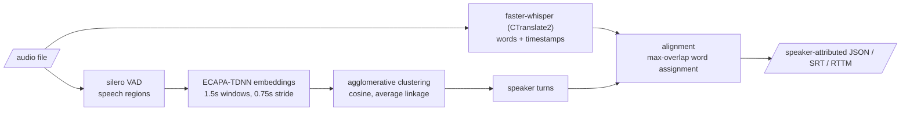

# speech-diarization-lab

[](https://github.com/gradientsj/speech-diarization-lab/actions/workflows/ci.yml)

Speaker-attributed transcription: who said what, with timestamps, from a
single audio file. Whisper (via CTranslate2) produces the words, a
diarization pipeline built from open parts produces the speakers, and a
tested alignment joins them. Everything that decides the output is scored:
WER and DER are implemented from scratch against hand-computed values, and
the diarizer is evaluated against the pretrained pyannote reference under
identical metrics on a reproducible benchmark.

## The problem

A transcript without speakers is close to unusable for meetings, interviews,
and calls; "who said what" is the actual product. Off-the-shelf pieces exist
for each stage (ASR, voice activity detection, speaker embeddings,
diarization pipelines), but the joins between them are where quality is won
or lost, and the joins are exactly what turnkey wrappers hide. This repo
builds the full path with every join visible and tested.

## The pipeline



Two diarization backends sit behind one interface, the same shape as my
other lab repos: a thing built from parts compared against a pretrained
reference.

- **`clustered`** (built here): silero VAD, windowed ECAPA-TDNN speaker
  embeddings, agglomerative clustering over cosine distance, turn building.
  Every stage boundary is a pure function with unit tests; the model calls
  are thin, isolated wrappers.
- **`pyannote`** (reference): the pretrained
  `pyannote/speaker-diarization-3.1` pipeline. Gated on Hugging Face, so it
  needs `HF_TOKEN` with the model terms accepted.

## Quickstart

```bash
uv sync --extra models          # core install is light; model backends are an extra

# full pipeline: transcribe + diarize + align
uv run diarlab attribute meeting.wav --srt meeting.srt

# stages individually
uv run diarlab transcribe meeting.wav --model small --compute-type int8
uv run diarlab diarize meeting.wav --num-speakers 2

# the gated reference backend (after accepting the pyannote model terms)
uv sync --extra reference
uv run diarlab diarize meeting.wav --backend pyannote
```

## Running the benchmark

The whole loop is three commands; the corpus is public and the mixtures are
seeded, so any machine reproduces the same benchmark bit for bit.

```bash
uv sync --extra models
uv run python -m diarlab.bench fetch      # LibriSpeech dev-clean, 337 MB
uv run python -m diarlab.bench build      # 12 seeded mixtures + manifest
uv run python -m diarlab.bench run --model small --compute-type int8 --device cpu
```

Each `run` writes `reports/benchmark_<backend>_<model>_<compute>_<device>.json`
with pooled WER, DER (split into miss / false alarm / confusion), per-mixture
rows, and ASR real-time factors.

On a CUDA box (tested on Lambda Stack / Ubuntu 22.04):

```bash
curl -LsSf https://astral.sh/uv/install.sh | sh
git clone https://github.com/gradientsj/speech-diarization-lab && cd speech-diarization-lab
uv sync --extra models
uv run python -m diarlab.bench fetch && uv run python -m diarlab.bench build
uv run python -m diarlab.bench run --model large-v3 --compute-type float16 --device cuda
```

If CTranslate2 cannot find cuDNN/cuBLAS (a `libcudnn` load error), point it
at the pip-installed NVIDIA libraries:

```bash
export LD_LIBRARY_PATH=$(uv run python -c "import os, nvidia.cublas.lib, nvidia.cudnn.lib; print(os.path.dirname(nvidia.cublas.lib.__file__) + ':' + os.path.dirname(nvidia.cudnn.lib.__file__))")
```

The gated reference backend, once `HF_TOKEN` is set and the pyannote model
terms are accepted:

```bash
uv sync --extra models --extra reference
uv run python -m diarlab.bench run --backend pyannote --device cuda
```

## How it is measured

- **WER** (word error rate) for transcription and **DER** (diarization error
  rate, md-eval semantics: missed speech + false alarm + speaker confusion
  over reference speech time, with a no-score collar and Hungarian speaker
  mapping) are implemented from scratch in plain Python and tested against
  hand-computed values, including the overlap and collar cases. The scoring
  math is the product here, so it should be auditable rather than imported.
- Where a metric is undefined (empty reference), it returns NaN, and NaN
  must be treated as a failure by anything gating on it.
- The benchmark is **synthetic conversations built from LibriSpeech**:
  single-speaker utterances interleaved with seeded gaps, so turn boundaries
  and transcripts are exact by construction and nothing requires credentials
  to download. The trade-off is stated plainly: no overlapped speech, no
  channel mismatch, read-speech acoustics. Scores on it are an upper bound
  on conversational performance and are for comparing systems under
  identical conditions, not for quoting as real-world accuracy.

## Results

Pooled over the 12 mixtures (10.9 minutes of audio, 2-4 speakers each),
DER collar 0.25 s, clustered backend at its default threshold 0.6 unless
marked oracle. GPU rows ran on an NVIDIA A10 (Lambda, Ubuntu 22.04), CPU
rows on a consumer Windows desktop. Per-mixture rows and exact configs are
in `reports/`.

### Transcription and serving

| model | compute | hardware | WER | mean RTF |
|---|---|---|---:|---:|
| tiny | float16 | A10 | 5.50% | 0.015 |
| base | float16 | A10 | 3.87% | 0.016 |
| small | float16 | A10 | **2.84%** | 0.022 |
| large-v3 | float16 | A10 | 4.23% | 0.087 |
| large-v3 | int8_float16 | A10 | 4.59% | 0.098 |
| large-v3 | int8 | A10 | 3.87% | 0.083 |
| tiny | int8 | CPU | 5.68% | 0.117 |
| base | int8 | CPU | 3.57% | 0.185 |
| small | int8 | CPU | 6.17% | 0.559 |

What the table says:

- **small beats large-v3 on this benchmark** (2.84% vs 3.87-4.59% at
  float16), at a quarter of the RTF. On clean read speech the largest model
  buys nothing, which is exactly why serving decisions should be made from
  a measured table rather than from model reputation.
- **int8 quantization is mostly accuracy-neutral, with one revealing
  exception.** On tiny, base, and large-v3 it matches float16 (it even
  edges it out on large-v3). On small, 11 of 12 mixtures match float16
  within noise, but on one mixture the int8 model silently drops whole
  utterances (59 of 157 reference words deleted, that mixture's WER 40.1%
  vs 3.8% at float16), inflating the pooled WER from 2.84% to 6.17%.
  Aggregate numbers hide exactly this kind of tail failure; the
  per-mixture rows in `reports/` are what surfaced it.
- RTF below 0.1 everywhere on the A10 means the full large-v3 pipeline
  clears real time with >10x headroom, and CPU int8 keeps even small at
  ~2x real time with tiny at 8.5x.

### Diarization

| backend | speaker count | DER | miss | false alarm | confusion |
|---|---|---:|---:|---:|---:|
| clustered (from parts) | estimated | **5.64%** | 4.36% | 0.00% | 1.28% |
| clustered (from parts) | oracle | 4.36% | 4.36% | 0.00% | 0.00% |
| pyannote-3.1 (reference) | estimated | 9.80% | 7.57% | 0.00% | 2.24% |

- The DER is **identical across every ASR configuration and across
  Windows-CPU vs Linux-A10**, per mixture to three decimals: the diarizer
  is fully decoupled from the ASR and deterministic across platforms.
- Given the true speaker count, confusion drops to exactly zero: clustering
  itself attributes no time to the wrong speaker on these mixtures. The
  whole 1.28% confusion component comes from overcounting speakers (3->4,
  4->5 on a few mixtures), and the 4.36% floor is missed speech at VAD
  boundaries. Each error component points at exactly one stage to improve.
- **The from-parts pipeline beats the pretrained reference here, and the
  caveat matters as much as the number.** pyannote-3.1 scores 9.80% on the
  same mixtures under the same DER implementation, with the gap mostly in
  missed speech (7.57% vs 4.36%): its segmentation trims utterance
  boundaries more aggressively than silero VAD on clean read speech with
  hard turn changes. That is the regime this benchmark constructs and the
  regime the simple pipeline is built for; pyannote is tuned for
  conversational audio with overlap and boundary ambiguity, none of which
  exists here. It estimated the speaker count correctly on 11 of 12
  mixtures (one 2->3 overcount). The honest claim is narrow: on
  non-overlapped read-speech mixtures, VAD + ECAPA + agglomerative
  clustering is sufficient and the heavier pipeline buys nothing -- the
  overlapped-speech mixtures planned below are where the ranking should
  flip.

## Repository layout

```
src/diarlab/
  metrics.py     # WER + DER from scratch, tested against hand-computed values
  align.py       # word -> speaker assignment rules (max overlap, gap fallback)
  windows.py     # VAD post-processing, embedding windows, turn building (pure)
  cluster.py     # agglomerative clustering over cosine distance
  mixtures.py    # synthetic conversations with exact ground truth
  asr.py         # faster-whisper wrapper (lazy import)
  vad.py         # silero VAD wrapper (lazy import)
  embeddings.py  # ECAPA-TDNN wrapper (lazy import)
  diarize.py     # the two backends behind one interface
  formats.py     # JSON / SRT / RTTM writers
  audio.py       # mono float32 loading + polyphase resampling
  cli.py         # transcribe / diarize / attribute
tests/           # CPU-only, no model downloads
```

## What I'd do next

1. **Fix what the error decomposition points at**: looser VAD padding for
   the 4.36% miss floor, and a better stopping rule for cluster count to
   recover the 1.28% confusion without the oracle.
2. **Calibrate the clustering threshold** on held-out mixtures instead of
   using the 0.6 default, and report sensitivity.
3. **Overlapped-speech mixtures**: the current benchmark has none, which
   flatters every system; partial-overlap construction is the obvious next
   stressor.
4. **A thin serving layer**: a small FastAPI endpoint over the attribute
   pipeline, with the RTF table informing batch vs. streaming decisions.
5. **Real conversational data**: AMI headset mix as a second benchmark with
   published baselines to sanity-check against.

## License

MIT
