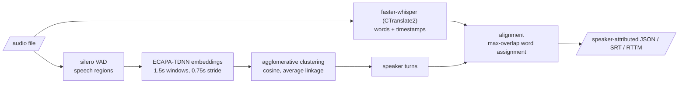

# speech-diarization-lab

[](https://github.com/gradientsj/speech-diarization-lab/actions/workflows/ci.yml)

Speaker-attributed transcription: who said what, with timestamps, from a
single audio file. Whisper (via CTranslate2) produces the words, a
diarization pipeline built from open parts produces the speakers, and a
tested alignment joins them. Everything that decides the output is scored:
WER and DER are implemented from scratch against hand-computed values, and
the diarizer is evaluated against the pretrained pyannote reference under
identical metrics on a reproducible benchmark.

## The problem

A transcript without speakers is close to unusable for meetings, interviews,
and calls; "who said what" is the actual product. Off-the-shelf pieces exist
for each stage (ASR, voice activity detection, speaker embeddings,
diarization pipelines), but the joins between them are where quality is won
or lost, and the joins are exactly what turnkey wrappers hide. This repo
builds the full path with every join visible and tested.

## The pipeline



Two diarization backends sit behind one interface, the same shape as my
other lab repos: a thing built from parts compared against a pretrained
reference.

- **`clustered`** (built here): silero VAD, windowed ECAPA-TDNN speaker
  embeddings, agglomerative clustering over cosine distance, turn building.
  Every stage boundary is a pure function with unit tests; the model calls
  are thin, isolated wrappers.
- **`pyannote`** (reference): the pretrained
  `pyannote/speaker-diarization-3.1` pipeline. Gated on Hugging Face, so it
  needs `HF_TOKEN` with the model terms accepted.

## Quickstart

```bash
uv sync --extra models          # core install is light; model backends are an extra

# full pipeline: transcribe + diarize + align
uv run diarlab attribute meeting.wav --srt meeting.srt

# stages individually
uv run diarlab transcribe meeting.wav --model small --compute-type int8
uv run diarlab diarize meeting.wav --num-speakers 2

# the gated reference backend (after accepting the pyannote model terms)
uv sync --extra reference
uv run diarlab diarize meeting.wav --backend pyannote
```

## How it is measured

- **WER** (word error rate) for transcription and **DER** (diarization error
  rate, md-eval semantics: missed speech + false alarm + speaker confusion
  over reference speech time, with a no-score collar and Hungarian speaker
  mapping) are implemented from scratch in plain Python and tested against
  hand-computed values, including the overlap and collar cases. The scoring
  math is the product here, so it should be auditable rather than imported.
- Where a metric is undefined (empty reference), it returns NaN, and NaN
  must be treated as a failure by anything gating on it.
- The benchmark is **synthetic conversations built from LibriSpeech**:
  single-speaker utterances interleaved with seeded gaps, so turn boundaries
  and transcripts are exact by construction and nothing requires credentials
  to download. The trade-off is stated plainly: no overlapped speech, no
  channel mismatch, read-speech acoustics. Scores on it are an upper bound
  on conversational performance and are for comparing systems under
  identical conditions, not for quoting as real-world accuracy.

## Results

Not measured yet. The benchmark harness lands next, in this order:

1. CPU numbers first: WER by Whisper size (tiny/base/small) at int8, DER for
   the `clustered` backend, and real-time factors.
2. The pyannote reference scored on the same mixtures with the same DER
   implementation, so the from-parts pipeline has something to be judged
   against.
3. GPU (RTX 4090) real-time factors and the CTranslate2 compute-type sweep
   (int8 / int8_float16 / float16), which is the serving-optimization story.

Numbers will appear here with sample sizes and the exact configuration that
produced them, nothing else.

## Repository layout

```
src/diarlab/
  metrics.py     # WER + DER from scratch, tested against hand-computed values
  align.py       # word -> speaker assignment rules (max overlap, gap fallback)
  windows.py     # VAD post-processing, embedding windows, turn building (pure)
  cluster.py     # agglomerative clustering over cosine distance
  mixtures.py    # synthetic conversations with exact ground truth
  asr.py         # faster-whisper wrapper (lazy import)
  vad.py         # silero VAD wrapper (lazy import)
  embeddings.py  # ECAPA-TDNN wrapper (lazy import)
  diarize.py     # the two backends behind one interface
  formats.py     # JSON / SRT / RTTM writers
  audio.py       # mono float32 loading + polyphase resampling
  cli.py         # transcribe / diarize / attribute
tests/           # CPU-only, no model downloads
```

## What I'd do next

1. **The benchmark harness and first numbers** (see Results above).
2. **Calibrate the clustering threshold** on held-out mixtures instead of
   using the 0.6 default, and report sensitivity.
3. **Overlapped-speech mixtures**: the current benchmark has none, which
   flatters every system; partial-overlap construction is the obvious next
   stressor.
4. **A thin serving layer**: a small FastAPI endpoint over the attribute
   pipeline, with the RTF table informing batch vs. streaming decisions.
5. **Real conversational data**: AMI headset mix as a second benchmark with
   published baselines to sanity-check against.

## License

MIT
